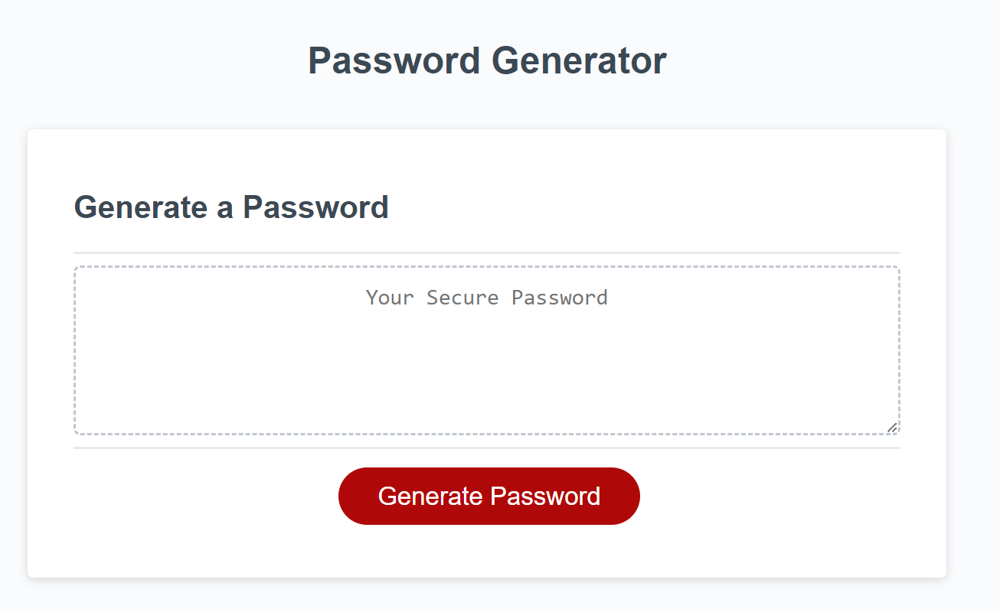

# JavaScript Password Generator

## Description

A simple, randomized password generator created using only HTML, CSS, and JavaScript

## Usage

This site has a simple interface, presenting users with a text area and a large, red "Generate Password" button.
Upon clicking the Generate Password button, users are presented with a prompt requesting input for the length of the password to be generated - between 8 and 128 characters. If a number is not entered, or the number is outside of the required range, an alert will remind users of the correct entry range and the prompt will be displayed again for new input.

Next, users are presented with 3 confirm messages, each allowing users to choose Yes or No in response to the inclusion of character types: lower case letters, upper case letters, and special characters (numbers 0-9 are automatically included).

Logic written in JavaScript will collect the user's parameters and apply them to random number functions.
Array variables with character options are randomly indexed by these functions and the result is pushed to a password until the specified character length has been reached.
Character types will be included or excluded dependent on user confirmations.

The final password will be written to the text area in the center of the page for copying to the desired application.

The site can be viewed at: https://creechj.github.io/JS_Password_Generator/

GitHub repository for the site can be found here: https://github.com/creechj/JS_Password_Generator

## Credits

W3 Schools' JavaScript pages were referenced for various syntax examples:
https://www.w3schools.com/jsref/default.asp

The special character options were selected using guidance provided by OWASP Foundation:
https://owasp.org/www-community/password-special-characters

Array join method to eliminate commas from string (credit to bootcamp classmate Danny Wittig for class-wide reminder/method):
https://javascript.plainenglish.io/how-to-turn-an-array-into-a-string-without-commas-in-javascript-241598bb054b

## License

Please refer to LICENSE included in repository